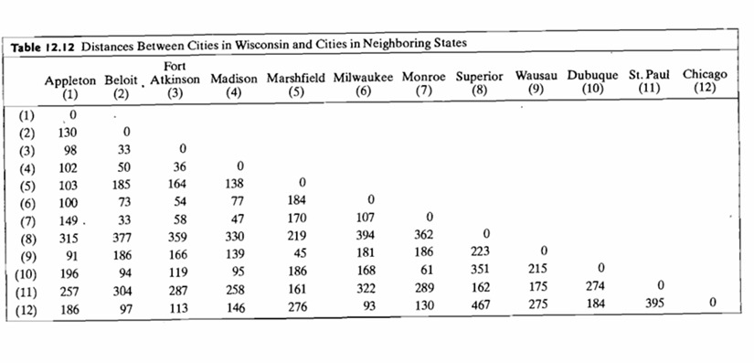

***Link del repositorio de GitHub: https://github.com/MauricioVazquezM/Multivariate_Statistical_Course_Assignments_Fall2024***

```{r setup, include=FALSE}
knitr::opts_chunk$set(echo = TRUE, tidy = TRUE, fig.width=10)

# Libraries
library(MASS)  
library(ggplot2)
library(GGally)
library(mclust)
library(kableExtra)
library(FactoMineR)
library(knitr)
library(caret)
library(dplyr)
library(gridExtra)
library(ggfortify)
library(copula)
```

## Q1: Analisis de componentes principales (PCA)

```{r fig.align='center', fig.width=5, fig.height=3, echo=FALSE}
# Especifica la ruta al archivo
file_path <- "C:\\Users\\mauva\\OneDrive\\Documents\\ITAM\\9no Semestre\\METODOS MULTIVARIADOS\\REPOSITORIO\\Multivariate_Statistical_Course_Assignments_Fall2024\\EXAM 02\\turtles.rda"

# Carga el archivo .rda
load(file_path)

# Variables numéricas
numerical_vars <- turtles[, c("length", "width", "height")]

# PCA
pca_result <- prcomp(numerical_vars, scale. = TRUE)

# Resumen del PCA
summary(pca_result)

# Añadir la variable 'sex' para colorear por sexo
projected_data <- data.frame(pca_result$x, sex = turtles$sex)

# Gráfico
ggplot(projected_data, aes(x = PC1, y = PC2, color = sex)) +
  geom_point(size = 3, alpha = 0.7) +
  labs(
    title = "Primeras 2 Componentes Principales",
    x = "Primera Componente Principal (PC1)",
    y = "Segunda Componente Principal (PC2)",
    color = "Sexo"
  ) +
  theme_minimal() +
  theme(
    plot.title = element_text(size = 14, face = "bold", hjust = 0.5),
    axis.title = element_text(size = 12),
    axis.text = element_text(size = 10),
    legend.position = "right"
  )
```


\newpage

## Q2: Cópula Clayton

```{r fig.align='center', fig.width=5, fig.height=3, echo=FALSE}
set.seed(42) 
# Parámetro de theta
theta <- 2  

# Cópula de Clayton
clayton_copula <- claytonCopula(param = theta, dim = 2)

# Simulando datos
n <- 1000  
simulated_data <- rCopula(n, clayton_copula)

# Pasando a un dataframe
data <- data.frame(x = simulated_data[, 1], y = simulated_data[, 2])

# Graficando
ggplot(data, aes(x = x, y = y)) +
  geom_point(alpha = 0.5, color = "blue") +
  geom_density_2d(color = "red") + 
  labs(
    title = "Simulación de una Cópula Clayton",
    x = "Variable 1",
    y = "Variable 2"
  ) +
  theme_minimal()

# Curvas de contorno
ggplot(data, aes(x = x, y = y)) +
  geom_density_2d_filled(contour_var = "density", alpha = 0.6) +
  labs(title = "Curvas de Contorno - Cópula de Clayton",
       x = "Variable 1",
       y = "Variable 2") +
  theme_minimal()

# Mostrar ambos gráficos en un solo layout
#grid.arrange(a, b, ncol = 2)
```


\newpage

## Q3: Escalamiento multidimensional

```{r fig.align='center', fig.width=5, fig.height=3,out.width='85%', echo=FALSE}


# Matriz de distancias
distances <- matrix(c(
  0, 130, 98, 102, 103, 100, 149, 315, 91, 196, 257, 186,
  130, 0, 33, 50, 185, 73, 33, 377, 186, 94, 304, 97,
  98, 33, 0, 36, 164, 54, 58, 359, 166, 119, 287, 113,
  102, 50, 36, 0, 138, 77, 47, 330, 139, 95, 258, 146,
  103, 185, 164, 138, 0, 184, 170, 219, 45, 186, 161, 276,
  100, 73, 54, 77, 184, 0, 107, 394, 181, 168, 322, 93,
  149, 33, 58, 47, 170, 107, 0, 362, 186, 61, 289, 130,
  315, 377, 359, 330, 219, 394, 362, 0, 223, 351, 162, 467,
  91, 186, 166, 139, 45, 181, 186, 223, 0, 215, 175, 275,
  196, 94, 119, 95, 186, 168, 61, 351, 215, 0, 274, 184,
  257, 304, 287, 258, 161, 322, 289, 162, 175, 274, 0, 395,
  186, 97, 113, 146, 276, 93, 130, 467, 275, 184, 395, 0
), nrow = 12, byrow = TRUE)

# Añadir nombres de filas y columnas
cities <- c(
  "Appleton", "Beloit", "Fort Atkinson", "Madison", "Marshfield", 
  "Milwaukee", "Monroe", "Superior", "Wausau", "Dubuque", "St. Paul", "Chicago"
)
colnames(distances) <- rownames(distances) <- cities

# MDS para 1, 2, 3 dimensiones
mds_1d <- isoMDS(distances, k = 1)
mds_2d <- isoMDS(distances, k = 2)
mds_3d <- isoMDS(distances, k = 3)

# Configuración bidimensional con el mapa real
mds_2d_points <- data.frame(mds_2d$points)
colnames(mds_2d_points) <- c("Dim1", "Dim2")
mds_2d_points$City <- cities

# Graficar la configuración bidimensional
ggplot(mds_2d_points, aes(x = Dim1, y = Dim2, label = City)) +
  geom_point() +
  geom_text(vjust = -0.5) +
  labs(title = "Escalamiento MDS Bidimensional de Ciudades",
       x = "Dimensión 1", y = "Dimensión 2") +
  theme_minimal() +
  #xlim(-250, 350) +
  #ylim(-100, 100) +
  scale_x_continuous(breaks = seq(-250, 350, by = 50)) +
  scale_y_continuous(breaks = seq(-100, 100, by = 25)) 
```
